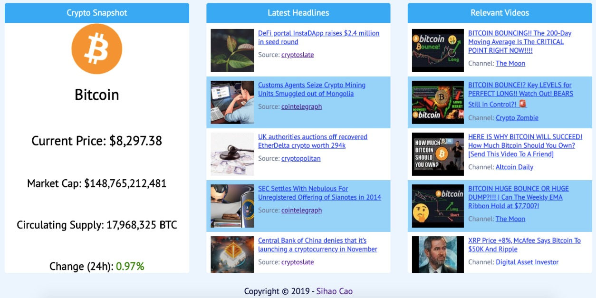
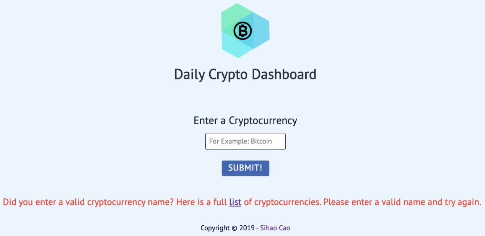

# Daily Crypto Dashboard
A dashboard that tells users the price, latest news headlines, and relevant videos for any chosen cryptocurrency.
## Demo
* [Live Demo](https://sihaocao.github.io/Daily-Crypto-Dashboard/)
## Motivation
Cryptocurrency is an up and coming technology that has the power to change the way we record and interact with data. As a cryptocurrency enthusiast, I wanted an app that can display the most vital information (e.g., price, market-cap, 24-hour percent change), latest headlines, and any relevant videos related to that asset in one place. As a result, the idea of a daily crypto dashboard was born.
## Screenshots
Landing Page:

Dashboard Page:

Error Message / Invalid Entry Message:

## How to Use the App
Enter the desired cryptocurrency's FULL NAME into the input field on the landing page and click on the "SUBMIT!" button or press "ENTER". Once the page is loaded, scroll down to view the results.
## Built With
* HTML
* CSS
* JavaScript
* jQuery
## Features
* See a snapshot of the chosen cryptocurrency's important statistics (current price, market cap, circulating supply, 24-hour percentage change)
* View a list of the latest news headlines
* View a list of the relevant videos
## Authors
* Sihao Cao